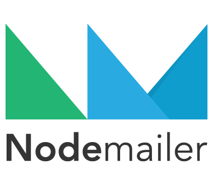
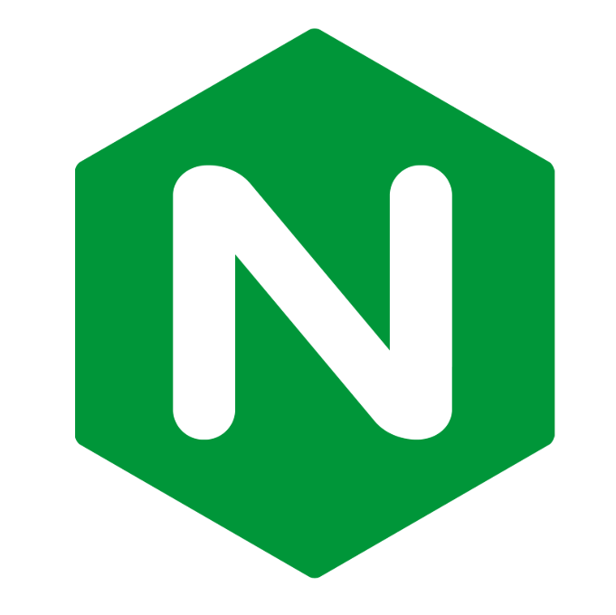

> [!IMPORTANT]
> This repository is still under development and does not yet reflect the final project.

<div style="text-align: center;">
  
</div>

<!-- PROJECT LOGO -->

<br />

<div align="center">

[](https://git.io/typing-svg)

</div>

<div>

  <p align="center">
    <b>A stock trading simulator built for beginners. Learn to trade without the risk</b>
    <br />
    <a href=""><strong>Explore the docs »</strong></a>
    <br />
    <br />
    <a href="#-features">Features</a>
    ·
    <a href="">Report Bug</a>
    ·
    <a href="">Request New Feature</a>
  </p>
</div>


<a id="readme-top"></a>

# 📝Overview 

Soict Stock Trading Platform is a full-stack web application that simulates a real-world stock trading environment. Designed for beginners and educational purposes, it allows users to practice trading stocks, manage portfolios, and learn about market dynamics in a safe, risk-free setting. 

For the security concern, we have implemented some measures by our best knowledge to mitigate common vulnerabilities and attacks. For more details, refer to the [Security Checklist](#-security-checklist) section.

## 🛠️ Technology Stack

The project is built with the following technologies:

<strong>Backend:</strong>
<div style="display: flex; flex-wrap: wrap; gap: 20px; align-items: center; margin-bottom: 20px;">
  
  
  
  
  
  
  
</div>

<strong>Frontend:</strong>
<div style="display: flex; gap: 20px; align-items: center; margin-bottom: 20px;">
  
  
  
  
</div>

<strong>Deployment:</strong>
<div style="display: flex; gap: 20px; align-items: center; margin-bottom: 20px;">
  
  
  
</div>

<strong>Security Testing:</strong>
<div style="display: flex; gap: 20px; align-items: center;">
  
  
</div>

<br>


# 📖 Features

> [!NOTE]  
> Be patient! It may take a while (~2 minutes) to load all the demo `gif` images of this Feature section.

⚡Quick look ⚡:

<div align="center">
   
</div >

Our application offers some key features:

- **User Authentication**:  Register or log in using email/username and password or using your Google account. Two-factor authentication (2FA) via OTP sent to your email is required on login. Optionally, you can select "Remember this device" to skip OTP next time. Includes "Forgot password" feature with OTP-based password reset.


  <div align="center">
    
  </div >

  *Captcha (Cloudflare Turnstile) is disabled by default during the development stage. To enable it, set the environment variable in `.env` to `product`*


- **View Stock board**: Browse a real-time stock list with live price updates. Click on any stock to view detailed info, including price history shown in candlestick and line charts.

  <div align="center">
    
  </div >

- **Virtual Order**: Creating large number of virtual sell/buy order to simulate the stock market.
  <div align="center">
    
  </div >

- **Tutorial**: Step-by-step guide to help new users navigate the app and understand basic stock trading concepts.

  <div align="center">
    
  </div >

- **Trading**:  Place buy/sell orders with support for both **market** and **limit** order types. You will get a notification at the home page when your order iss matched.

  <div align="center">
    
  </div >

- **Portfolio**: Track your portfolio including available balance, estimated total value, the stocks you own, view transaction history and add funds to your account.

   <div align="center">
    
  </div >

- **Admin page** (for admin account only): Start or end a trading session.

  <div align="center">
    
  </div >

 

# 🚀 Installation & Setup

## Option 1: Using Docker

If you just want to **quickly try out the app** without diving into the code, we’ve got you covered with a `docker-compose` setup. Follow these steps:

1. Download the [`docker-compose.yml`](docker-compose.yml) file.
2. Create a `.env` file in the same directory as the docker-compose file, following the template in [`env.example`](env.example), replace the values with your own credentials.
3. Start Docker on your machine.
4. Run the following command in the directory containing `docker-compose.yml`:

```bash
docker-compose up
```
This will pull the latest images for the backend, frontend, and database from Dockerhub then build and run them in containers.


The web will be available at:

- Frontend: http://localhost:5173

- Backend API: http://localhost:3000

- pgAdmin (UI management tool for PostgreSQL): http://localhost:5050

## Option 2: Building from Source

> [!NOTE]
> Prerequisites: We assume that you have **Node.js**, **Yarn** installed on your system.

If you're interested in exploring the code and running the project manually, follow these steps:

1. **Clone the repo and navigate to the project directory**
   ```bash
    git clone https://github.com/chutrunganh/Stock-Trading-Platform.git
    cd Stock-Trading-Platform
    ```

2. **Set up environment variables**

    Create a .env file in the project root by copying the template from .env.example, then fill in the required values by your own credentials. 

3. **Set up the database**

    You have two options:

    - **Option 1**: Install PostgreSQL manually via the their official website.

    - **Option 2**: Use our Docker setup to run only the database. In this case, you need to command out our backend and frontend services inside the docker-compose file to run the database only. 
    
    
    In both case, please recheck variables in the `.env` to make sure that:
    - `DB_HOST` is `localhost`, not `postgres`
    - `BE_URL` is `http://localhost:3000`, not a domain name
    - `FE_URL` is `http://localhost:5173`, not a domain name
      
    Then run `docker-compose up` to start the database.

    For detailed instructions on database setup, including configuration variables and solutions to common issues, we highly recommend taking a quick look at our [Database Setup Guide](docs/setupInstructions/setupDatabase.md).


4. **Start the backend**
    ```bash
    cd app/backend
    yarn install # Install dependencies
    yarn start
    ```
5. **Start the frontend**
    ```bash
    cd app/frontend
    yarn install # Install dependencies
    yarn dev
    ```

6. **Open your browser and navigate** to `http://localhost:5173` to see the web in action.


> [!TIP]
> When you start the backend, it will automatically connect to the database and seed some initial data. However, for stock prices, it only seeds data for one day, so the chart may not display fully as shown in the demo due to insufficient historical data. To populate the database with realistic stock prices, we provide a Python script that fetches real-world stock data and inserts it into the database. You can find the script in `app/backend/src/utils/seedStockPrice`. Please refer to [this guide](app\backend\src\utils\seedStockPrice\README.md) for instructions on how to run it.

## Optional: Package the web with Docker 🐳

If you want to package the whole application with your source code changes to Docker images, update the `docker-compose.yml` file:

1. Uncommen the backend and frontend service, then under the `build` section, comment out the `image` lines (which pull from Docker Hub).

2. Then, uncomment the `context` and `dockerfile` lines.

3. Check again the `.env` file, pay attention to these variables:

| Variable  | Description                                                                                                                      | Example Value                                         |
| --------- | -------------------------------------------------------------------------------------------------------------------------------- | ----------------------------------------------------- |
| `DB_HOST` | Must be set to `postgres`, **not** `localhost`                                                                                   | `postgres`                                            |
| `BE_URL`  | Backend URL. Use: <br> - `http://localhost:3000` if running locally <br> - `YOUR_DOMAIN_NAME` if exposing via Cloudflare Tunnel  | `http://localhost:3000` or `https://soictstock.io.vn` |
| `FE_URL`  | Frontend URL. Use: <br> - `http://localhost:5173` if running locally <br> - `YOUR_DOMAIN_NAME` if exposing via Cloudflare Tunnel | `http://localhost:5173` or `https://soictstock.io.vn` |


> [!NOTE]
> Make sure FE_URL and BE_URL are set correspondingly, depending on whether you're running locally or using a public domain.


This will build the Docker images directly from the source code in the `./app/backend` and `./app/frontend` directories, which already contains the `Dockerfile`. This will run 4 services:

- Backend
- Frontend + Nginx as a proxy
- Postgres SQL
- Pgadmin

Access te webpage at: `http://localhost:5173`.

You can take an additional step to securely expose your Docker services to the internet using Cloudflare Tunnel (formerly Argo Tunnel). To do this, register a tunnel and link it to the domain name you specify in the `BE_URL` and `FE_URL` variables in your `.env` file. Then, follow the official instructions on the Cloudflare website to run the tunnel and make your services publicly accessible. The webpage now can be access via `https://soictstock.io.vn`.

# 🏗️ Project Structure

## Overall Structure

```plaintext
Stock-Trading-Platform/
├── app/
│   ├── backend/        
│   │   ├── src/              # Source code for the backend
│   │   │── package.json      # Backend dependencies
│   │   └── Dockerfile        # Dockerfile for backend
│   │
│   └── frontend/             # Source code for the frontend
│       ├── src/              # Source code for the frontend
│       │── package.json      # Frontend dependencies
│       ├── vite.config.js    # Vite configuration file
│       ├── nginx.conf        # Nginx configuration file
│       └── Dockerfile        # Dockerfile for frontend
│
├── docs/
│   ├── design/                 # Detail system design documents
│   ├── reports/                # Project reports
│   ├── setupInstructions/      # Setup instructions for the project
│   ├── techStack/              # All the technologies used, details guide configuring them.
│   └── stockFundementalThoery/ # Some financial terminology, mechanism of order matching, etc.
│
├── .env                # Environment variables (not committed to GitHub)
├── .env.example        # Example environment variables file (serve as a template)
└── docker-compose.yml  # Run the whole app with Docker
```

# Deployment Architecture

```plaintext
                            ┌────────────────────────────┐
                            │    🌐 Public Internet      │
                            └────────────┬───────────────┘
                                         │
                                         ▼
                          ┌─────────────────────────────┐
                          │   🌩️ Cloudflare Proxy Edge  │
                          └────────────┬────────────────┘
                                       │  (Tunnel)
                                       ▼
               ┌──────────────────────────────────────────────────┐
               │          🖥️ Local Machine (Docker Host)          │
               │  (All services isolated inside Docker network)   │
               │                                                  │
               │  ┌──────────────────────────────────────────┐    │
               │  │  🛡️ cloudflared (Cloudflare Tunnel)      │    │
               │  │  - Forwards to frontend:5173 (Nginx)     │    │
               │  └────────────┬─────────────────────────────┘    │
               │               │                                  │
               │               │                                  │
               │      ┌────────┴───────────┐                      │
               │      │   frontend         │                      │
               │      │   (Nginx 5173:80)  │                      │
               │      └────────┬───────────┘                      │
               │               │                                  │
               │               │                                  │
               │        ┌──────┴───────────┐   ┌────────────────┐ │
               │        │  backend         │───┤  postgres      │ │
               │        │(Node 3000:3000)  │   │  (DB 5432:5432)│ │
               │        └──────────────────┘   └──────┬─────────┘ │
               │                                      │           │
               │                                ┌─────┴───────┐   │
               │                                │  pgAdmin    │   │    
               │                                │ (UI 5050:80)│   │    
               │                                └─────────────┘   │     
               └──────────────────────────────────────────────────┘
```

**Format: $HOST_PORT:$CONTAINER_PORT*


## Code review with Qodana

<div align='center'>
  
</div>

All warning at `Critical`, `High` level have been fixed. There are still some `Medium` level warnings left we can not fix yet due to time constraints.


<!-- CONTRIBUTING -->
# 🤝 Contributing

Contributions are what make the open source community such an amazing place to learn, inspire, and create. Any contributions you make are **greatly appreciated**.

If you have a suggestion that would make this better, please fork the repo and create a pull request. You can also simply open an issue with the tag "enhancement".
Don't forget to give the project a star! Thanks again!

1. Fork the Project
2. Create your Feature Branch (`git checkout -b feature/AmazingFeature`)
3. Commit your Changes (`git commit -m 'Add some AmazingFeature'`)
4. Push to the Branch (`git push origin feature/AmazingFeature`)
5. Open a Pull Request

For the success of this project, I want a special thanks to:

- **Project supervisor**: MSc. TRINH THANH TRUNG
- **Team members**:

  | Name | Student ID | %Con |
  |:--|:--|:--|
  | Chu Trung Anh | 20225564 | 25% |
  | Nguyễn Tiến Thành | 202255459 | 15% |
  | Phạm Minh Tiến (leader) | 20225555 | 15% |
  | Tăng Triệu Long | 20225507 | 15% |
  | Nguyễn Minh Đức | 20225567 | 15% |
  | Nguyễn Quang Trung | 20225557 | 15% |


<!-- LICENSE -->
# 📜 License

[](https://www.apache.org/licenses/LICENSE-2.0)


Distributed under the Apache-2.0 License License. See `LICENSE` for more information.


<!-- CONTACT -->
# 📧 Contact

This project is maintained by: Chu Trung Anh - [Email](mailto:chutrunganh04@gmail.com).

Feel free to contact me if you have any question or suggestion.

<p align="right">(<a href="#readme-top">back to top</a>)</p>


# For frontend Dev

See the API specifications in the this [docs](app/backend/testAPI.http) folder to understand how to use the API. Install REST Client extension in your VSCode to run this file.

# Run the project

Make sure you have **Node.js**, **Yarn** and **Docker** installed on your machine.

1. Create a `.env` file under the root directory, see the content inside the `.env.example` file. You can copy the content from `.env.example` to `.env` and change the values accordingly.

2. Initialize the database by running docker-compose. This will create a PostgreSQL database and a pgAdmin instance:

    ```bash
    docker-compose up -d # -d is for detached mode, incase the database is not running, remove -d to see the logs
    # docker-compose down # to stop the database
    ```

    All related configurations like databse name, user, password, running port, etc. are definied by you in the `.env` file created in step 1. In case you do not change anything, you can now access the PgAdmin instance at `http://localhost:5050`, then setup PgAdmin to manage the Postgres database with GUI, see [setupInstruction](docs\setupInstructions\setupDatabase.md) for more detail.

3. Navigate to the backend directory and run the following command:

    ```bash
    cd app/backend
    yarn install # to install the dependencies
    yarn start # to start the server
    ```
4. Test the backend API by sending requests to the endpoints. You can use Postman or any other API testing tool. See [API specifications](docs\setupInstructions\setupPostmanRequests.md) for more detail.

# Dependencies

In this proejct, I use **Yarn** to manage dependencies. Some of the dependencies are:

- **Express**: to build RestFul API
- **dotenv**: to load environment variables
- **pg**: to connect to PostgreSQL database and do query
- **cors**: to enable CORS
- **joi**: schema validation, any request come to our controller will be validated by joi first
- **bcrypt**: to hash password
- **jsonwebtoken**: to create and verify JWT tokens

*CORS (Cross-Origin Resource Sharing) is a security feature implemented by web browsers to control how resources on a web page can be requested from another domain outside the domain from which the resource originated. The purpose of using CORS is to allow or restrict web applications running at one origin (domain) to access resources from a different origin. This is important for enabling secure cross-origin requests and data sharing between different domains.*


# Folder structure

```plaintext
stock-market-simulator/
|
├── app/                        # All application code here
│   ├── backend/ 
│   │   │── src/                   
│   │   │   ├── config/         # Stores configuration (e.g., database connection, environment variables)
│   │   │   ├── controllers/    # Receives requests -> passes them to the appropriate service -> returns response to the client
│   │   │   ├── middleware/     # Middleware functions (e.g., validation, logging, error handling)
│   │   │   ├── models/         # Defines objects schemas (e.g., user, stock, transaction)
│   │   │   ├── routes/         # Specifies API endpoints to call corresponding controller functions
│   │   │   ├── services/       # Called by cointroller to handle business logic 
│   │   │   └── index.js        # Entry point for the backend application
│   │   │
│   │   │── package.json        # Backend dependencies
│   │   └── yarn.lock           # Yarn lock file
|   | 
│   └── frontend/               # Contains all ReactJS frontend code
│       ├── public/             # Static assets like index.html
│       ├── src/                # Source code
│       │   ├── assets/         # Images, fonts, etc.
│       │   ├── components/     # Reusable UI pieces (e.g., buttons, stock cards).
│       │   ├── pages/          # Full pages (e.g., Stock List, User Dashboard)
│       │   ├── services/       # Functions to fetch data from the backend
│       │   ├── styles/         # CSS/SCSS files
│       │   ├── utils/          # Utility functions
│       │   ├── App.js          # Main app component
│       │   └── index.js        # Entry point
│       ├── tests/              # Frontend tests
│       └── package.json        # Frontend dependencies
| 
├── docs/                      
│   ├── design/                 # Usecase diagram, class diagram, database design, etc.
│   ├── setupInstruction/       # Instruction to setup database, requests in Postman, etc.
│   ├── api/                    # API specifications
│   └── reports/                # Project reports
|
├── scripts/                    # Holds scripts for automation (e.g., deployment, testing)
│   ├── deploy.sh               # Deployment script
│   └── test.sh                 # Test script
|
├── .github/                    # GitHub configurations
│   └── workflows/              # CI/CD workflows
│       ├── ci.yml              # Continuous integration
│       └── cd.yml              # Continuous deployment
|
├── .env                        # Environment variables file, this will not include in the version control, recreate it from .env.example
├── .env.example                # Example of environment variables file
├── docker-compose.yml         # Docker Compose file to setup PostgreSQL and pgAdmin
├── .gitignore                  
├── README.md                   
└── LICENSE                
```

# Backend Workflow Overview  

>index.js → routes → (middlewares) → controllers → services → models → services → controllers → (middlewares) → response to client.

For more detail:

`index.js` listens for incoming requests and directs them to the appropriate route  &rarr; The route handler is called, which is defined in the `routes` directory. The route handler specifies the endpoint and the HTTP method (GET, POST, PUT, DELETE) &rarr; The route then calls the corresponding controller function  &rarr; The request might go through some middleware functions (e.g., validation, logging) in the `middlewares` folder before reaching the controller  &rarr; The controller function takes in the request, then passes parameters to service functions to perform the actual business logic (see `controllers` folder)  &rarr; The service functions, see `services` folder, may interact with the database model (see `models` folder)  &rarr; The controller receives the data from the service functions and processes it as needed  &rarr; Finally, the response (usually in **JSON format**) is sent back to the client.  


# Branch strategy

- `main` Branch
    - Purpose: Holds production-ready, stable code.
    - Usage: Only fully tested and approved changes are merged here, typically from release or hotfix branches.

- `develop` Branch
    - Purpose: Acts as the integration branch for ongoing development.
    - Usage: Both frontend and backend teams merge their feature branches here to combine their work continuously, triggering CI/CD pipelines 

- `feature`/ Branches
    - Purpose: Short-lived branches for specific tasks or features.
    - Naming: Use prefixes to indicate the team (frontend or backend) then the features:  `features/frontend-<feature-name>` or `features/backend-<feature-name>`. For example, if the frontend team is working on a login feature, the branch name could be `feature/frontend-login`. If the backend team is working on authentication, the branch name could be `feature/backend-auth`. 
    
    - Workflow: Created from `develop`, worked on by one developer (or a small team if needed), and merged back into develop via pull requests (PRs)

- `release` Branches
    - Purpose: Prepare for a new production release.
    - Naming: Use a versioning system, e.g., `release/v1.0.0`.
    - Workflow: Created from `develop` when the code is ready for release. This branch is used for final testing and bug fixes before merging into `main`.

- `hotfix` Branches
    - Purpose: Quickly address critical issues in production.
    - Naming: Use a versioning system, e.g., `hotfix/v1.0.1`.
    - Workflow: Created from `main` to fix urgent bugs. After the fix, it is merged back into both `main` and `develop`.

&rarr; Each developer creates a `feature/` branch from `develop` for their assigned task. When the task is done, they create a pull request to merge their changes back into `develop`. Once the code is merged into `develop`, it can be tested and eventually `merged` into main when ready for production.