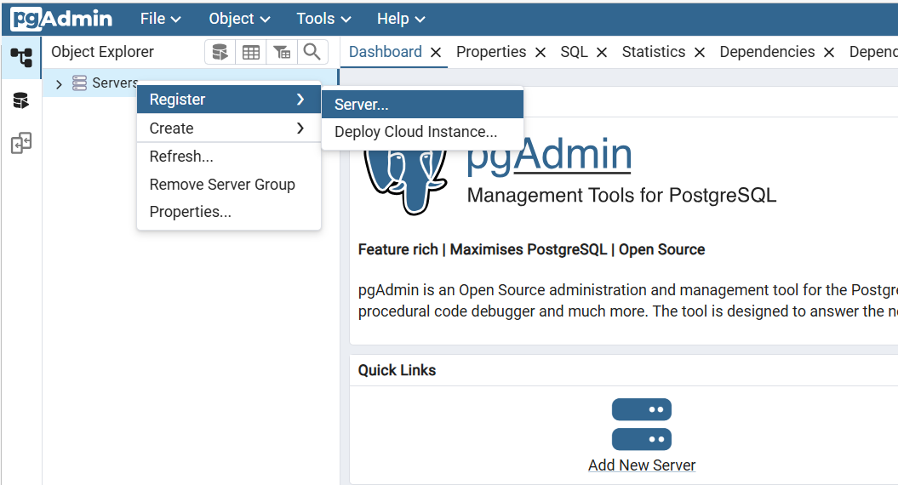
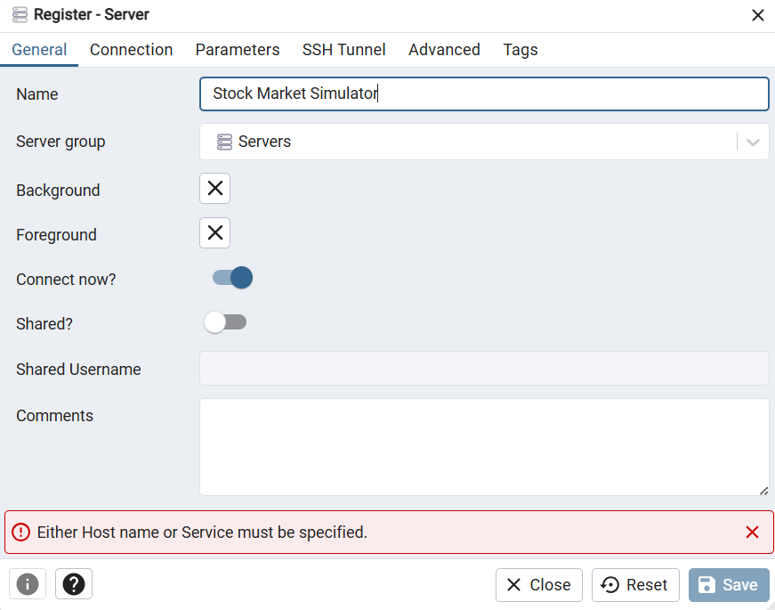
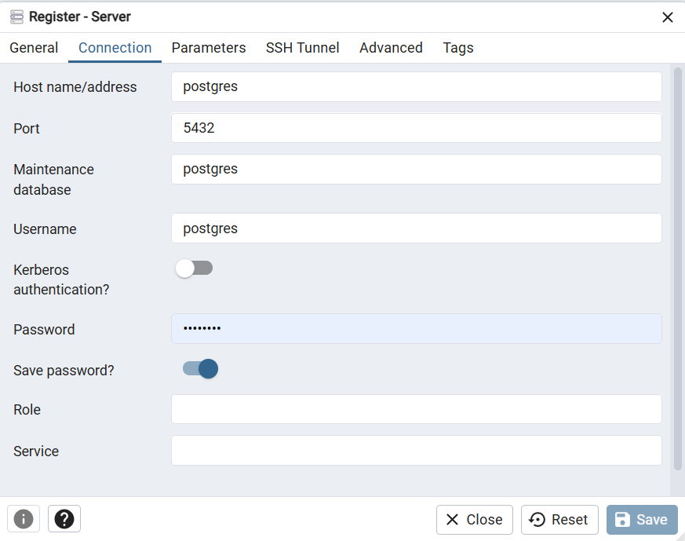
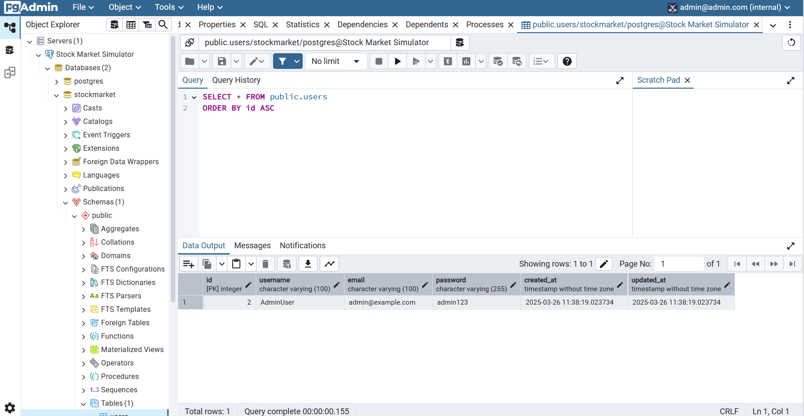

The Postgres databse and PgAdmin (to manage the database with GUI) are run in Docker containers, so just simply run `docker-compose up -d` to bring them up. The `-d` flag is for detached mode, which means the containers will run in the background. If you want to see the logs, you can remove the `-d` flag. The database name, user, password, and port of both PostgresSQL and PgAdmin are defined in the `.env` file. 

Access `http://localhost:5050` to access PgAdmin, enter credential based on field `PGADMIN_DEFAULT_EMAIL` and `PGADMIN_DEFAULT_PASSWORD` inside `.env` to login. Now we setup PgAdmin:

1. On the left panel, right click on "Servers" and select "Register" -> "Server...".

2. Enter name of the server as you wish:

3. Change to the "Connection" tab, enter the following information:

- Host name/address: postgres (must use the same as PostgreSQL service name as defined in the `docker-compose.yml` file)
- Port: see the `BD_PORT` field in the `.env` file
- Username: see the `DB_USER` field in the `.env` file
- Password: see the `DB_PASSWORD` field in the `.env` file

Click "Save" to save the server configuration. After that, you should see your database viewable in the left panel. Click on the database name to see the tables inside.

 

4 . To stop the database, run `docker-compose down` in the root directory of the project or `docker-compose down -v` to remove the volumes as well. The `-v` flag will remove the database and all data inside it, so be careful with this command.