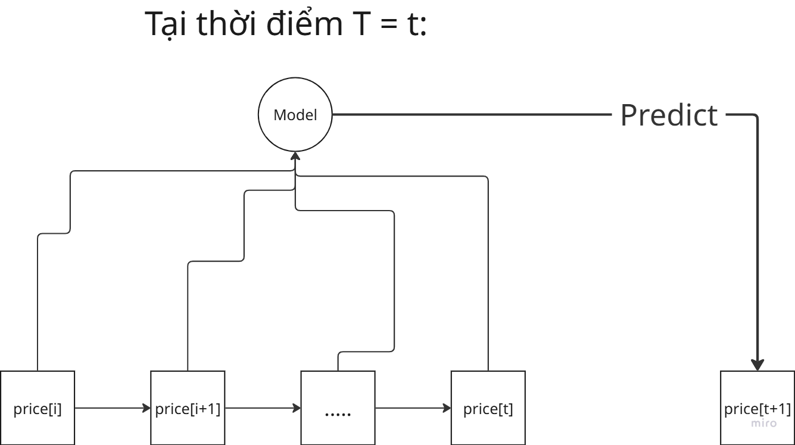

# Các phương án mô phỏng giá cổ phiếu 

# 1. Mô phỏng sử dụng các phương pháp dự đoán sử dụng Machine Learning/AI (Monte Carlo, Neural Network, ......):

Trong cách này thì cách tiếp cận sẽ là: Lấy bảng giá cổ phiếu trong khoảng thời gian (1 tháng, 3 tháng, …. hay toàn bộ lịch sử). Sử dụng cơ chế giống như cửa sổ trượt để tiếp tục dự đoán các giá trị tiếp theo, xem hình vẽ mô phỏng ở dưới

Dựa trên nguyên lý **Markov bậc k**: trạng thái thứ `t+1` của một stochastic process xấp xỉ phụ thuộc vào k trạng thái trước nó. Xem thêm tại [Markov property](https://en.wikipedia.org/wiki/Markov_property). **Input array** được đưa vào model sẽ là một Python list kích thước **k**, bao gồm hai methods chính là pop(0) và append().

Sau khi dự đoán `price[t+1]`, giá trị này sẽ được thêm vào **input array** cho Model, phần tử `price[i]` sẽ bị loại ra ngoài, quy trình này tiếp tục tương tự cho các giá trị `price[t+2]`, …….

**Ưu điểm**: việc dự đoán giá này hoàn toàn phụ thuộc vào model sử dụng, không cân nhắc đến các yếu tố kinh tế, thị trường, ……. Vì thế nên việc cài đặt khá đơn giản, ngoài ra **input array** được giữ nguyên kích thước sẽ giải quyết vấn đề yêu cầu truy cập cơ sở dữ liệu, do model chỉ cần lấy `k` giá cổ phiếu gần nhất từ cơ sở dữ liệu, chuyển đến các thư mục xử lý tương ứng, hệ thống sẽ vận hành tuần hoàn mà không cần truy vấn gì thêm từ cơ sở dữ liệu &rarr; giảm tải cho server.

**Nhược điểm**: Hoàn toàn phụ thuộc vào hiệu năng của model, mà thực tế chưa có model ML/AI nào hoàn toàn mô phỏng được biến động giá, vì thế nên khó có thể thỏa mãn yêu cầu mô phỏng giá thực tế. Tuy nhiên nếu mục tiêu chỉ là đem lại “cảm giác thực tế” thì hoàn toàn đáng cân nhắc. Ngoài ra mỗi loại cổ phiếu cần chuẩn bị sẵn dữ liệu về giá trong cơ sở dữ liệu để model có thể xử lý được. Thêm nữa giá trị cửa sổ `k` cần linh hoạt với các cổ phiếu khác nhau.

# 2. Thêm các sự kiện ngẫu nhiên & lấy thêm thông tin từ `Order Book`

Các sự kiện ngẫu nhiên ở đây có thể là thay đổi chính trị, thay đổi cơ cấu kinh tế, lạm phát …… Tất cả sự kiện này đều có điểm chung là làm thay đổi biên độ giá của các cổ phiếu một cách đột ngột do hiện tượng FOMO, bán tháo, …. Vì thế nên ta sẽ gộp chung các sự kiện này thành một lớp `Events`. Khi `Events` xảy ra thì giá của một vài cổ phiếu sẽ thay đổi, thay vì: 

`price[t+1] = Model.predict(input_array)` thì sẽ trở thành:

`price[t+1] = Model.predict(input_array) x Events.coeff` 

Với **Events.coeff** là mức độ ảnh hưởng mà Events gây ra. Việc các Events xảy ra như nào hay ảnh hưởng ra sao sẽ diễn ra ngẫu nhiên, sẽ có một danh sách các sự kiện mẫu và tỷ lệ tương ứng (VD: khủng hoảng kinh tế có tỷ lệ xảy ra là 5%, etc..).

Thông tin từ `Order Book` cũng có thể được sử dụng để góp phần vào việc dự đoán giá cổ phiếu. Chúng ta có thể biết sơ bộ được rằng lượng cung và cầu của các cổ phiếu, giá trị khớp lệnh, .... Từ đó đưa thêm dữ liệu cho các quyết định thay đổi giá. 

**Ưu điểm**: việc bổ sung các yếu tố này đã thêm một vài các yếu tố thực tế vào yếu tố thay đổi giá của cổ phiếu, tuy nhiên vẫn chỉ còn ở mức độ thấp. Tuy nhiên một lần nữa mục tiêu chính là tạo ra cảm giác "thực tế", nên có thể chỉ cần như vậy là đủ.

**Nhược điểm**: với `Order Book` thì yêu cầu phải có các bên đặt lệnh mua và bán &rarr; yêu cầu có users sử dụng hệ thống. Mà phần mềm của chúng ta khó có thể đáp ứng việc đó. Một phương án khả thi là sử dụng `Trading Bots`, nhưng đây là vấn đề hoàn toàn khác với **Price Simulation**.

